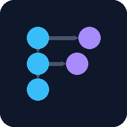
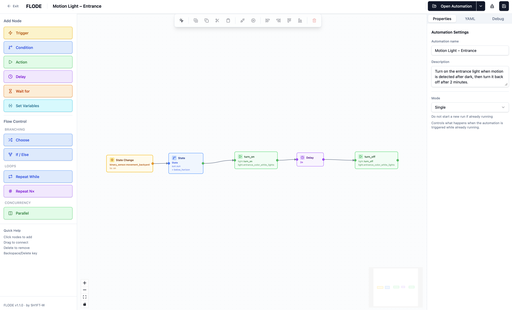
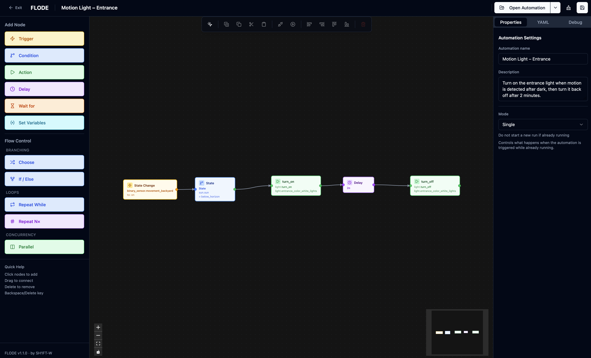

<div align="center">
  <p><a href="README.md">🇩🇪 Deutsch</a> · 🇬🇧 <strong>English</strong></p>

  
  <h1>FLODE</h1>
  <p><strong>Visual Flow + Node Editor for Home Assistant</strong></p>

  <p>
    
    
    
    
    
  </p>

  <table>
    <tr>
      <td align="center"><b>Light Mode</b></td>
      <td align="center"><b>Dark Mode</b></td>
    </tr>
    <tr>
      <td></td>
      <td></td>
    </tr>
  </table>
</div>

---

> **Fork notice:** FLODE is based on [C.A.F.E.](https://github.com/FezVrasta/cafe-hass) by [@FezVrasta](https://github.com/FezVrasta). This repository is a fork with numerous bug fixes, improvements, and a complete rebranding to FLODE. Changes compared to the original are documented in the [CHANGELOG](CHANGELOG.md).

> **Beta:** FLODE is designed not to overwrite any existing data. Nevertheless, we recommend backing up your automations before editing them.

## What is FLODE?

**FLODE** is a visual flow editor for Home Assistant automations — inspired by Node-RED, but without an external server. You draw your automations as diagrams and FLODE automatically transpiles them into **100% native Home Assistant YAML**, stored directly in the HA core. No vendor lock-in. No external service. Automations remain fully editable in HA's built-in editor.

## Features

- **Visual flow editor** — Drag and drop triggers, conditions, and actions onto a canvas
- **100% native YAML** — The output is standard HA automation YAML, no proprietary format
- **Bidirectional** — Import existing HA automations, edit them visually, and save them back
- **Trace integration** — Debug flows with the official HA trace view
- **State machine support** — Complex loops and branches via an automatic state machine pattern
- **German & English** — Full i18n support
- **Dark & light mode** — Follows your configured HA theme

## Installation

### Via HACS (recommended)

**Button (one click):**

[](https://my.home-assistant.io/redirect/hacs_repository/?owner=SH1FT-W&repository=flode&category=integration)

**Manually in HACS:**

1. Open HACS → Integrations → ⋮ → Custom repositories
2. Enter the URL `https://github.com/SH1FT-W/flode`, select type **Integration** → Add
3. HACS → Integrations → Search for **FLODE** → Install
4. Restart Home Assistant
5. **Settings → Integrations → Add Integration → FLODE**

### Manually (without HACS)

1. Download the latest version from the [Releases page](https://github.com/SH1FT-W/flode/releases) (`flode.zip`)
2. Extract the archive and copy the `flode/` folder to `config/custom_components/flode/`
3. Restart Home Assistant
4. **Settings → Integrations → Add Integration → FLODE**

## Usage

After setup, **FLODE** appears in the HA sidebar. Simply click it to open the flow editor.

- **New automation** — Start with a trigger node, then add conditions and actions
- **Import existing** — Load an existing HA automation via the folder icon
- **Save** — Saves directly to Home Assistant as a native automation
- **Export YAML** — View or copy the generated YAML code at any time

## Node Types

| Node | Color | Description |
|---|---|---|
| Trigger | Yellow | What starts the automation (state, time, event, ...) |
| Condition | Blue | Filter — only continues if the condition is met |
| Action | Green | What happens (call a service, fire an event, delay, ...) |
| OR / AND / NOT | Purple | Group multiple conditions |

## Project Structure

```
flode/
├── custom_components/flode/   # HA integration (Python)
│   ├── brand/                 # Integration icons
│   ├── translations/          # DE + EN setup texts
│   └── www/                   # Built frontend files
├── packages/
│   ├── frontend/              # React/Vite UI (@flode/frontend)
│   ├── transpiler/            # YAML ↔ graph logic (@flode/transpiler)
│   └── shared/                # Zod schemas + types (@flode/shared)
└── __tests__/                 # YAML round-trip fixtures
```

## Technology

- **Frontend:** React 18, Vite, Tailwind CSS, React Flow (xyflow), Zustand, i18next
- **Transpiler:** TypeScript, js-yaml, ELK layout engine
- **Validation:** Zod schemas
- **Tests:** Vitest (260 tests)
- **HA integration:** Python, custom panel via `panel_custom`

## Changelog

All changes can be found in the [CHANGELOG.md](CHANGELOG.md).

## License

Apache 2.0 — see [LICENSE](LICENSE)

---

<div align="center">
  <sub>Fork by <strong>SH1FT-W</strong>, based on <a href="https://github.com/FezVrasta/cafe-hass">C.A.F.E.</a> by Federico Zivolo · Actively developed with <a href="https://claude.ai">Claude (Anthropic)</a></sub>
</div>
