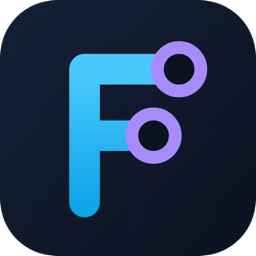
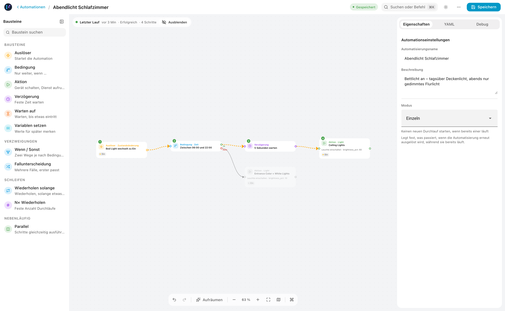
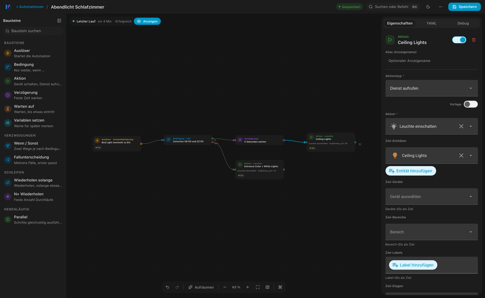

  

  <h1>FLODE</h1>

  
<strong>A visual flow editor for Home Assistant automations.</strong>

  
  
  

   

  **[Website](https://sh1ft-w.github.io/flode)** &nbsp;·&nbsp; [Installation](#installation) &nbsp;·&nbsp; [Changelog](CHANGELOG.md) &nbsp;·&nbsp; [Issues](https://github.com/SH1FT-W/flode/issues)

   

  | Light | Dark |
  |:---:|:---:|
  |  |  |

 

Draw an automation as a diagram — triggers, conditions, actions, connected on a canvas — and FLODE transpiles it into **100% native Home Assistant YAML**, stored directly in HA core. No external server, no proprietary format, no lock-in. What you build stays fully editable in HA's own automation editor, too.

> FLODE is a fork of [C.A.F.E.](https://github.com/FezVrasta/cafe-hass) by [@FezVrasta](https://github.com/FezVrasta), rebuilt with a long list of fixes and features — see the [changelog](CHANGELOG.md). It never overwrites existing data, but back up your automations before editing anyway.

## Features

**Visual, not code-first.** Drag trigger, condition, and action nodes onto a canvas and connect them. Undo/redo, quick-add on connection drop, and a live YAML preview throughout.

**Genuinely native.** Every automation is standard HA YAML — nothing proprietary, nothing hidden. Import an existing automation, edit it visually, save it back.

**Built for real logic.** State machines handle loops and branching automatically. Choose, If/Else, Repeat, and Parallel are draggable blocks. Full metadata — icon, category, labels, area — and targeting by area, device, label, or floor.

**Feels like Home Assistant.** Native pickers and components throughout, with automatic light/dark theming. A trace overlay highlights an actual automation run directly on the canvas. Deep links open a specific automation from any dashboard button.

**Speaks your language.** Full German and English support, with a per-installation override.

## Installation

## License

Apache 2.0 — see [LICENSE](LICENSE)

 

  Fork by <strong>SH1FT-W</strong>, based on <a href="https://github.com/FezVrasta/cafe-hass">C.A.F.E.</a> by Federico Zivolo · Built with <a href="https://claude.ai">Claude (Anthropic)</a>

