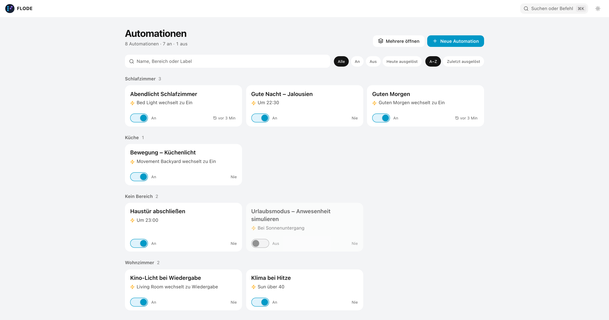
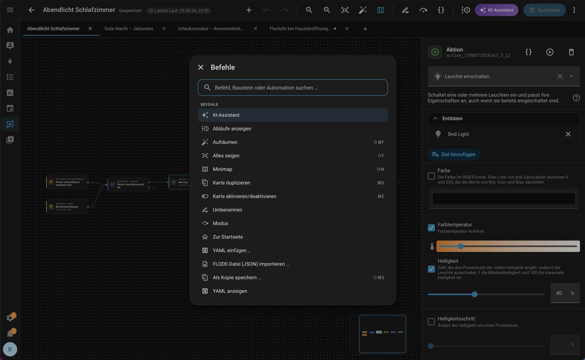

  

  <h1>FLODE</h1>

  
<strong>A visual flow editor for Home Assistant automations.</strong>

  
  
  

   

  **[Website](https://sh1ft-w.github.io/flode)** &nbsp;·&nbsp; [Installation](#installation) &nbsp;·&nbsp; [Changelog](CHANGELOG.md) &nbsp;·&nbsp; [Issues](https://github.com/SH1FT-W/flode/issues)

   

  | Light | Dark |
  |:---:|:---:|
  |  |  |

 

Draw an automation as a diagram — triggers, conditions, actions, connected on a canvas — and FLODE transpiles it into **100% native Home Assistant YAML**, stored directly in HA core. No external server, no proprietary format, no lock-in. What you build stays fully editable in HA's own automation editor, too.

> FLODE is a fork of [C.A.F.E.](https://github.com/FezVrasta/cafe-hass) by [@FezVrasta](https://github.com/FezVrasta), rebuilt with a long list of fixes and features — see the [changelog](CHANGELOG.md). It never overwrites existing data, but back up your automations before editing anyway.

## New in 2.1: AI assist

If you have an AI set up in Home Assistant (Anthropic, OpenAI, Google Gemini, Ollama …), FLODE can use it — no extra key, no extra service:

- **Create with AI** — describe what should happen, get a draft flow built from your real entities. FLODE checks it before you ever see it and nothing is saved until you save.
- **Explain a run** — one click on the *Last run* chip and the AI tells you in plain words why an automation did (or didn't) do its job.

FLODE uses the AI Task chosen as default under *Settings → System → AI → AI suggestions → Data generation tasks* — without one these buttons simply don't appear, and admins get a short setup guide on the start screen instead.

## What's new in 2.0

FLODE 2.0 is a ground-up redesign of the editor — calmer, faster to use, and much closer to how you think about an automation.

| Start screen | Command palette |
|:---:|:---:|
|  |  |

- **Start screen** — every automation at a glance, grouped by area, with search, filters, an on/off switch per card and a plain-language preview of what triggers it.
- **Cards you can read** — nodes say what they do ("Bed light changes to On", "Between 06:00 and 22:00") and show the live state of their entity.
- **⌘K / Ctrl+K command palette** — insert blocks, run any command, open any automation. Right-click menus and a full set of keyboard shortcuts (press `?`).
- **Last run on the canvas** — see the path your automation actually took the last time it ran, step by step, with errors right on the card that failed. Updates live.
- **Tidy up** — one click lays out the whole flow.
- **Problems, not error dumps** — a clickable list of everything that blocks saving; each entry jumps to its step.
- **Quick save** — ⌘S / Ctrl+S saves straight to Home Assistant.
- **Nothing gets lost** — steps FLODE has no block for (e.g. `scene:` shorthand, newer HA features) are kept verbatim as editable YAML steps.
- **Home Assistant 2026 ready** — the new target-based triggers and conditions (e.g. *Light turned on*, *Vibration detected*) with HA's own editors, and Jinja2-templated action names.

## Features

**Visual, not code-first.** Drag trigger, condition, and action blocks onto a canvas and connect them — or press `+` on a card to add the next step. Undo/redo and a live YAML preview throughout.

**Genuinely native.** Every automation is standard HA YAML — nothing proprietary, nothing hidden. Open an existing automation, edit it visually, save it back.

**Built for real logic.** Choose, If/Else, Repeat, and Parallel are draggable blocks. Full metadata — icon, category, labels, area — and targeting by area, device, label, or floor.

**Feels like Home Assistant.** Native pickers and HA's own translations throughout, with automatic light/dark theming. Deep links open a specific automation from any dashboard button.

**Speaks your language.** Full German and English support, with a per-installation override.

## Installation

## License

Apache 2.0 — see [LICENSE](LICENSE)

 

  Fork by <strong>SH1FT-W</strong>, based on <a href="https://github.com/FezVrasta/cafe-hass">C.A.F.E.</a> by Federico Zivolo · Built with <a href="https://claude.ai">Claude (Anthropic)</a>

